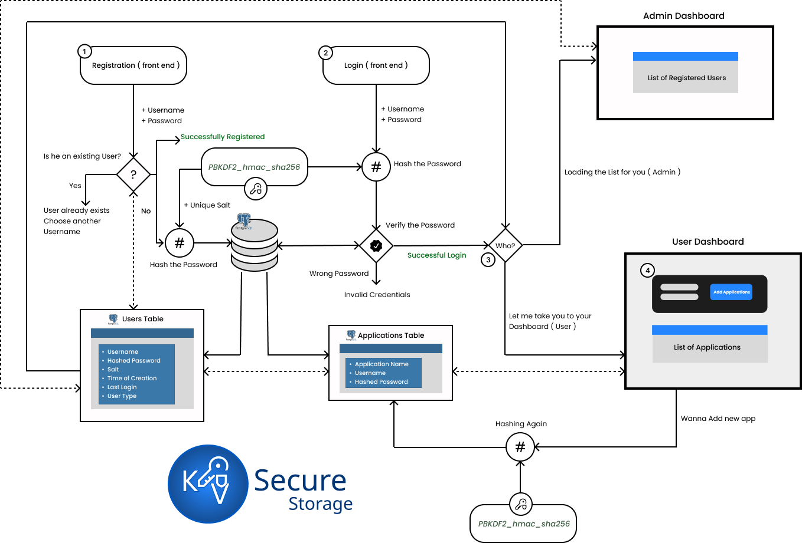

# 🔐 Secure Password Storing Tool (KV Secure Storage)

[]()
[]()

A modern, research-based password storage system implementing **PBKDF2-HMAC-SHA256** for secure password hashing and management.  
Developed as part of the **SWE 681 Final Project** at *George Mason University* by **Koushik Rama** and **Vu Khanh Pham**.

---

## 🧭 Overview
**KV Secure Storage** demonstrates best practices in secure password storage and authentication.  
It replaces outdated methods such as MD5 or SHA-1 with a modern.  
The system balances **security** and **usability** by introducing deliberate computational hardness while maintaining practical performance.

---

## 📘 Abstract
This project presents a password storage system using a PBKDF2 variant with SHA-256 hashing, salting, and HMAC to resist brute-force and rainbow-table attacks.  
The implementation—built with **Python (Flask)**, **PostgreSQL**, and a **React-based UI**—offers an effective balance between system performance and password security.  
Benchmarks show 100 000 iterations producing ~1 s authentication latency, providing strong security without degrading user experience.  
Future work includes Argon2 integration, memory-hardening, modular algorithm support, and hardware-based randomness.

---

## ⚙️ Architecture

frontend/ → React UI for password management

backend/ → Flask REST API implementing PBKDF2-HMAC-SHA256

database/ → PostgreSQL (secure storage for salts and hashes)




### 🧰 Technologies
- **Backend:** Python 3 | Flask | psycopg2 | hmac  
- **Frontend:** React.js  
- **Database:** PostgreSQL  
- **Security:** PBKDF2-HMAC-SHA256 

---

## 🚀 Execution

### Backend Setup
```bash
cd backend/
pip install -r requirements.txt
python app.py
```

### Frontend Setup
```bash
cd frontend/
npm install
npm start
```

## ▶️ Usage

Once both servers are running:

1. Open [http://localhost:3000](http://localhost:3000) in your browser.  
2. Register or log in with your credentials.  
3. Add, view, and manage stored passwords securely.  
4. Passwords are encrypted and stored only in hashed form in the database.  
5. Use browser DevTools or API tools (like Postman) to test backend endpoints if needed.


---

## 🔑 How It Works

1. User registers with a username + password.  
2. A **128-bit salt** is generated using `os.urandom()`.  
3. Passwords are hashed via **PBKDF2-HMAC-SHA256** with **100,000 iterations**.  
4. Hash + salt are stored in PostgreSQL — plaintext passwords are **never** saved.  
5. On login, the entered password is re-hashed and compared securely in constant time.

---

## 🧪 Performance Results

| Iterations | Time (ms) |
|:-----------:|:---------:|
| 1 | 0.15 |
| 1,000 | 11.78 |
| 100,000 | 1,024.42 |

- **Optimal:** 100,000 iterations (~1 s per hash)  
- **Complies with:** NIST SP 800-132  
- **Defends against:** Rainbow tables · Brute-force · Timing attacks  

---

## 🔐 Security Highlights

- Unique per-user salts (≥ 128 bits entropy)  
- Constant-time hashing (prevents timing leaks)  
- Configurable iteration count for security tuning  
- Modular design supports Argon2, bcrypt, SHA-3 in the future  
- Zero plaintext storage — hashes and salts only  
- Separate credential and vault storage tables  

---

## 🧩 Future Work

- Add **Argon2id** and **bcrypt** hashing options  
- Include **memory-hard** hashing and hardware RNG  
- Integrate **2FA**, **browser extensions**, and **vault encryption**  
- Implement **password strength analysis** and **secure password generation**  
- Move towards **post-quantum cryptography (PQC)** compliance  

---

## 📄 Project Documentation

- 📘 [Final Report (PDF)](./SWE681_FinalProject_Report_Group_05.pdf)  
- 📊 [Presentation Slides (PPTX)](./SWE681_FinalProject_Presentation_Group_05.pptx)

---

## 🧠 References

- IBM Security – *Cost of a Data Breach Report 2023*  
- Verizon – *Data Breach Investigations Report 2023*  
- NIST SP 800-132 – *Recommendation for Password-Based Key Derivation*  
- OWASP – *Password Storage Cheat Sheet 2023*  
- Biryukov et al. – *Argon2: New Generation of Memory-Hard Functions*, IEEE S&P 2016  

---

## 🤝 Contributors

- **Koushik Rama** – [GitHub Profile](https://github.com/KoushikRama)  
- **Vu Khanh Pham** – George Mason University  

---


